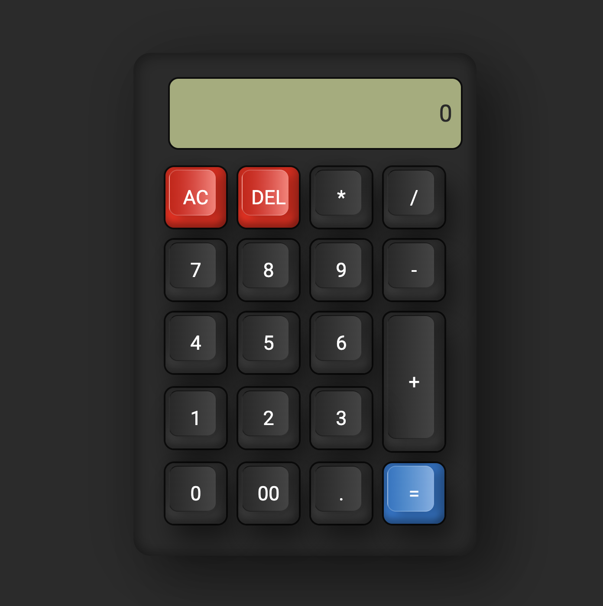

# Calculator

A simple and elegant calculator built using HTML, CSS, and JavaScript.

## Table of Contents

- [Features](#features)
- [Demo](#demo)
- [Installation](#installation)
- [Usage](#usage)
- [Contributing](#contributing)
- [License](#license)

## Features

- Basic arithmetic operations: addition, subtraction, multiplication, and division.
- Clear button to reset the input.
- Responsive design for different screen sizes.
- User-friendly and intuitive interface.
